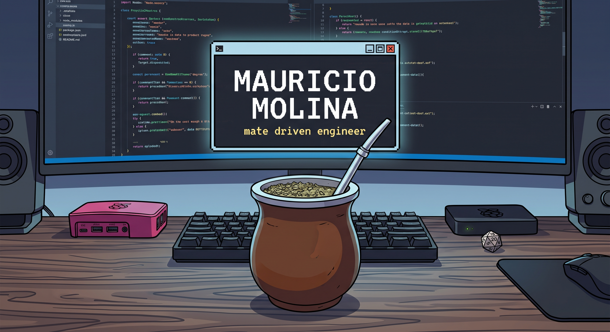

  

Software Engineer with a strong focus on crafting resilient backend architectures backend systems, software architecture, and building things that make sense.

### 🚀 What I bring to the table
- **Distributed Systems & Core Services**: Architecting fault-tolerant, event-driven backends and clean domain boundaries primarily with Python and Django, built to withstand load and evolution.
- **Data Reliability & Persistence**: Designing high-integrity storage foundations in PostgreSQL—focused on transactional safety, indexing strategy, and latency under concurrency.
- **Platform & Cloud Enablement**: Automating infrastructure and delivery lifecycles using AWS and Docker to ensure reproducible, zero-drift production environments.
- **Technical Strategy & Execution**: Grounded in formal systems analysis. Stripping away architectural bloat and choosing operational simplicity over trend-driven engineering.

  

